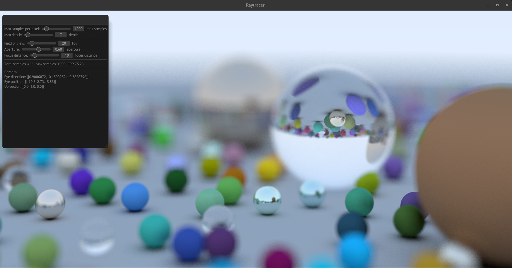
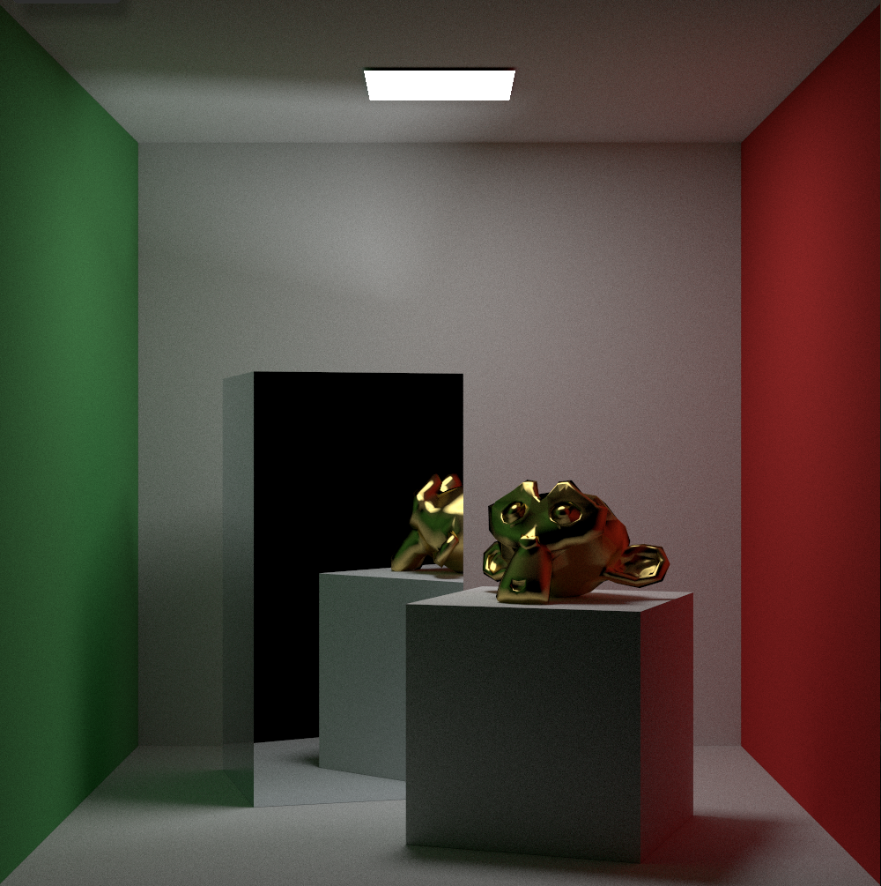
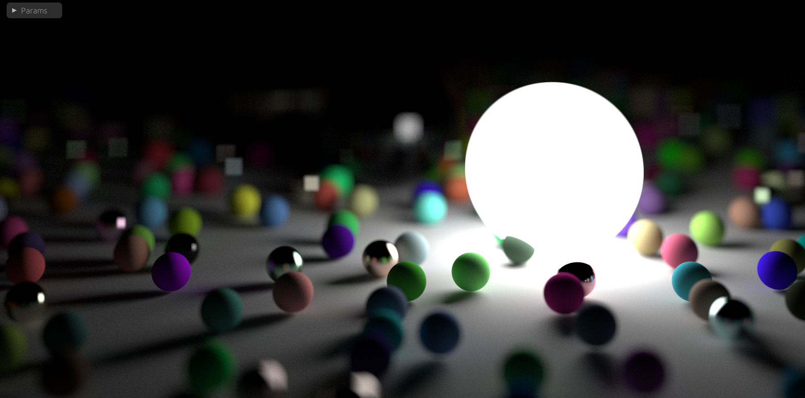

# sviet

Yet another pathracer
Built with wgpu, winit, egui

## Status

Currently in work in progress

[Raytracer the rest of your life](https://raytracing.github.io/books/RayTracingTheRestOfYourLife.html) is partially implemented.
I currently have some issue about PDF light sampling.

Loading model also works but need more enhancement to be able to apply translation/rotation/scaling at runtime

When all of that will be done next step will be to implement PBR material.





## Build to WASM

```
cargo install trunk
trunk build --features webgpu
trunk serve --features webgpu
```

<!-- Will not work currently
```
wasm-pack build --target web pathracer-wgpu
``` -->

## Run to web

### NextJS project

TODO
